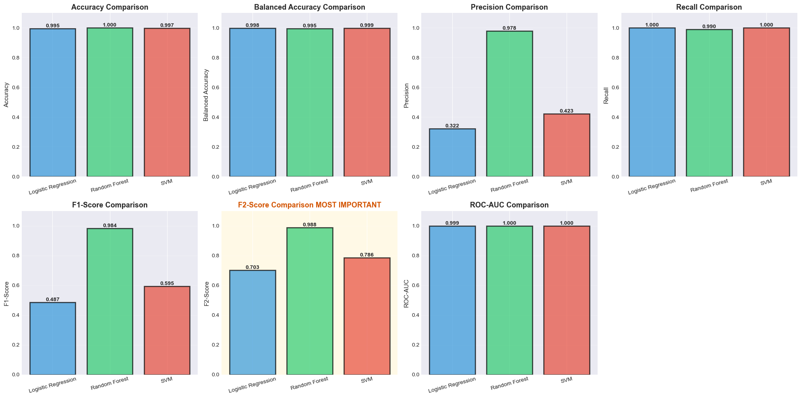
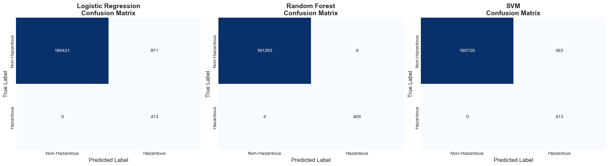
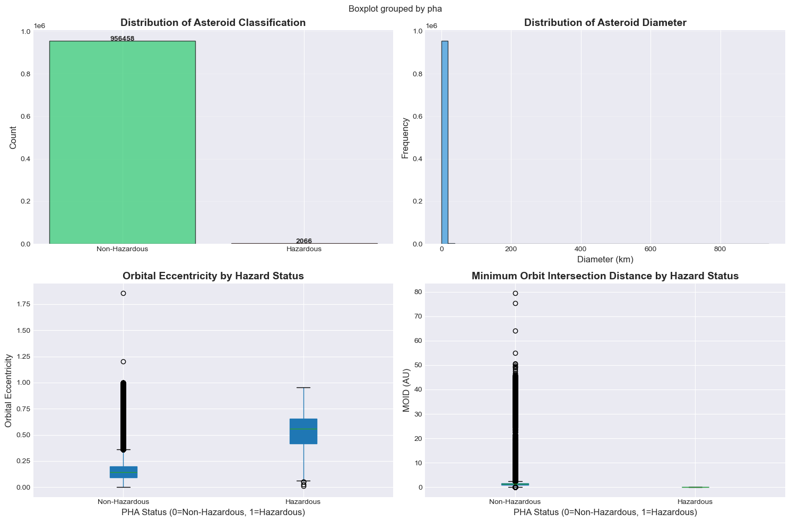
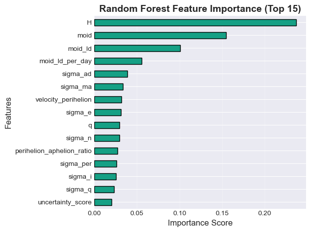

# Hazardous Asteroid Detection


Machine learning models that flag **potentially hazardous asteroids (PHAs)** from orbital and physical data, where only about 1 in 460 asteroids is hazardous. Served through an interactive Streamlit app.

**Team project at Blekinge Institute of Technology (BTH), 2026.**

## Results

Test set: 191,705 asteroids, of which 413 are hazardous (the real class balance is kept).

| Model | F2 score | Recall | Precision | Missed hazards | False alarms |
|---|---|---|---|---|---|
| **Random Forest** | **0.988** | **99.0%** | **97.8%** | 4 | 9 |
| Linear SVM (calibrated) | 0.786 | 100% | 42.3% | 0 | 563 |
| Logistic Regression | 0.703 | 100% | 32.2% | 0 | 871 |

**Why F2?** Missing a hazardous asteroid is far worse than a false alarm, so the F2 score weights recall twice as much as precision. Random Forest gives the best balance: it catches 409 of 413 hazards with only 9 false alarms, while the linear models catch every hazard but raise 60 to 100 times more false alarms.





## Approach

1. **Data:** 958,524 asteroids with 45 columns: orbital elements (eccentricity, semi-major axis, perihelion distance, inclination, MOID and more), absolute magnitude, diameter, albedo and uncertainty values. Target: `pha` (Y/N).
2. **Cleaning:** Identifier and text columns dropped, leaving 35 features; missing values handled.
3. **Feature analysis:** Correlation with the target, SelectKBest scores, Random Forest importance and PCA.
4. **Class imbalance:** Only 0.22% of asteroids are hazardous. The training set is rebalanced with SMOTE (minority raised to 30% of the majority) and then undersampled to about 3:1. The test set is left untouched.
5. **Models:** Logistic Regression, Random Forest and Linear SVM, all class-weighted, compared on accuracy, balanced accuracy, precision, recall, F1, F2 and ROC-AUC.
6. **App:** A Streamlit interface for exploring the data and predictions.

| Data exploration | Feature importance |
|---|---|
|  |  |

## Limitations

PHA status is defined by thresholds on two of the input features: minimum orbit intersection distance (MOID of 0.05 AU or less) and absolute magnitude (H of 22 or less). Tree models can learn these thresholds almost directly, which explains the near-perfect Random Forest scores. A harder and more realistic next step is to predict hazard status without MOID and H, or from early, uncertain orbit estimates.

## Run it

```bash
pip install pandas numpy scikit-learn imbalanced-learn matplotlib seaborn plotly streamlit jupyter
jupyter notebook                 # run Asteroid-Detection.ipynb (Kernel > Restart & Run All, about 15 to 20 min)
python -m streamlit run app.py   # opens at http://localhost:8501
```

`dataset.csv` (about 436 MB) is not included because of GitHub's file size limit. Place it in the project root before running the notebook.

## Project structure

```
Asteroid-Detection.ipynb   Data cleaning, feature analysis, resampling, training and evaluation
app.py                     Streamlit app
images/                    Charts exported from the notebook
dataset.csv                Asteroid data (not included)
```
